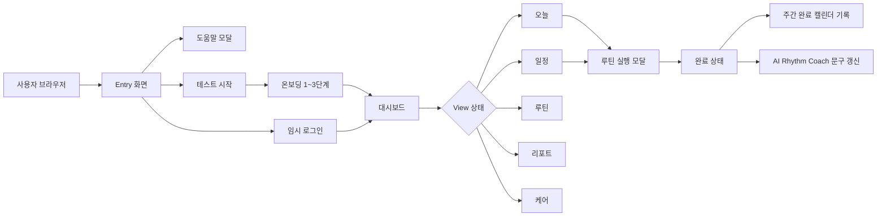
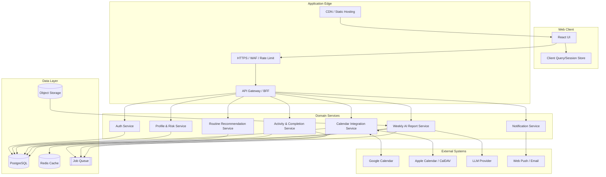
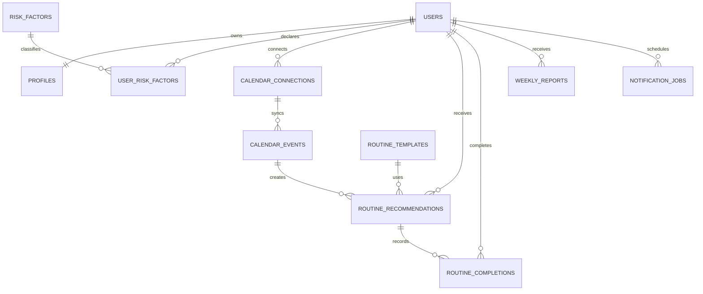
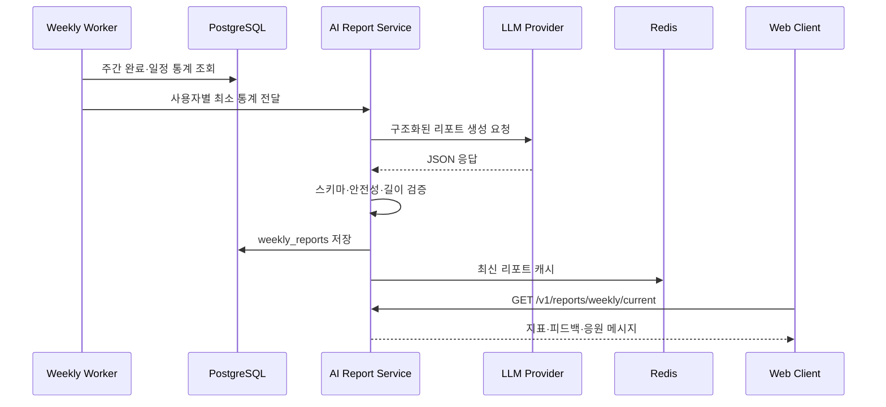

# 리듬(Life Rhythm) 웹앱 시스템 아키텍처

**작성자:** Manus AI  
**기준 버전:** `0556c3d2`  
**기준일:** 2026-09-06  
**문서 목적:** 현재 구현된 웹앱의 구조를 정확히 기록하고, 캘린더·인증·AI 리포트·활동 데이터 연동을 확장할 때 필요한 목표 아키텍처를 정의한다.

## 1. 아키텍처 요약

현재 앱은 **React 19 + TypeScript + Vite 기반의 클라이언트 중심 정적 웹앱**이다. 애플리케이션의 주요 화면과 상태는 `client/src/pages/Home.tsx` 하나의 기능 모듈에 집중되어 있으며, `wouter`가 최상위 라우팅을 담당한다. 서버는 Express로 정적 산출물을 제공하고 모든 경로에서 `index.html`을 반환하는 단순 정적 호스팅 경계만 제공한다.

현재 구조는 프로토타입 검증에는 적합하지만, 실제 사용자 계정, 캘린더 OAuth, 루틴 이력 저장, AI 리포트 생성, 알림을 지원하려면 **웹 클라이언트와 도메인 API를 분리하고 영속 데이터 계층을 추가**해야 한다. 아래 문서는 이를 두 단계로 구분한다.

| 구분 | 현재 구현 | 목표 확장 구조 |
|---|---|---|
| 실행 형태 | React 단일 페이지 앱 | React 앱 + 도메인 API + 비동기 워커 |
| 데이터 보존 | React state 기반, 새로고침 시 초기화 | PostgreSQL 기반 사용자·일정·루틴·리포트 저장 |
| 인증 | 임시 로그인/테스트 버튼 | 세션 또는 JWT 기반 인증, OAuth 연계 |
| 캘린더 | 샘플 일정 목록과 연결 상태 | Google/Apple 캘린더 OAuth 및 증분 동기화 |
| AI 리포트 | 목표와 완료 여부에 따른 로컬 문구 분기 | 주간 집계 파이프라인 + LLM 리포트 생성 + 캐시 |
| 알림 | 미구현 | 웹 푸시 또는 이메일·모바일 푸시 |
| 운영 | 정적 산출물 호스팅 | 모니터링, 감사 로그, 재시도, 데이터 보존 정책 |

## 2. 현재 시스템 아키텍처

### 2.1 실행 흐름

사용자는 진입 화면에서 도움말, 테스트 시작, 로그인, 회원가입 중 하나를 선택한다. 테스트 시작은 3단계 온보딩으로 이동한다. 임시 로그인은 온보딩을 건너뛰고 샘플 프로필을 설정한 뒤 대시보드로 이동한다. 대시보드는 `View` 상태로 오늘, 일정, 루틴, 리포트, 케어 화면을 전환한다.

### 2.2 레이어별 구성

| 레이어 | 구현 위치 | 책임 |
|---|---|---|
| 애플리케이션 진입 | `client/src/main.tsx`, `client/src/App.tsx` | React root 생성, 오류 경계, 테마, 전역 Tooltip과 Toaster, 라우팅 시작 |
| 라우팅 | `client/src/App.tsx` | `/`를 `Home`에 연결하고 `/404` 및 fallback 처리 |
| 화면·도메인 상태 | `client/src/pages/Home.tsx` | Entry, 온보딩, 대시보드, 일정, 루틴, 케어, AI 리포트 화면과 상태 전환 |
| UI 컴포넌트 | `client/src/components/ui/*` | shadcn/ui 계열 버튼, 카드, 다이얼로그, 폼, 차트 등 재사용 컴포넌트 |
| 스타일·테마 | `client/src/index.css`, `ThemeContext.tsx` | Tailwind 토큰, 배경 `#F8FAFC`, 주색 `#3DDC84`, 모션, 반응형 스타일 |
| 정적 자산 | Manus storage 경로 | 식물 일러스트 등 이미지 제공 |
| 정적 서버 | `server/index.ts` | `dist/public` 정적 파일 제공, SPA fallback, 포트 수신 |

### 2.3 현재 상태 모델

현재 상태는 서버 저장 모델이 아니라 `Home` 컴포넌트의 React state다. 따라서 브라우저 새로고침 또는 다른 기기 접속 시 데이터가 유지되지 않는다.

| 상태 | 타입 또는 예시 | 의미 |
|---|---|---|
| `entryStarted` | `boolean` | 진입 화면을 통과했는지 여부 |
| `onboardingStep` | `1 \| 2 \| 3` | 위험 요인, 목표, 캘린더 설정 단계 |
| `profile` | `ProfileSetup` | 목표, 위험 요인, 캘린더 연결 여부 |
| `view` | `home \| calendar \| routine \| report \| care` | 대시보드 현재 화면 |
| `actionOpen` | `boolean` | 마이크로 루틴 실행 모달 표시 여부 |
| `activeRecommendation` | `Recommendation` | 실행 중인 루틴 제목, 설명, 시간, 태그, 행동 큐 |
| `secondsLeft` | `number` | 루틴 타이머 잔여 시간 |
| `completed` | `boolean` | 현재 세션 루틴 완료 여부 |

### 2.4 현재 기능 흐름

#### 온보딩

사용자는 선택적인 위험 요인을 입력하고, 집중력 회복·기본 활동량·일정 관리 중 하나의 목표를 선택한다. 마지막 단계에서는 샘플 캘린더 연결 여부와 일정 미리보기를 확인한다. 설정 완료 후 프로필이 메모리 상태에 반영된다.

#### 캘린더 화면

현재 캘린더 화면은 실제 외부 캘린더 API가 아니라 샘플 이벤트 배열을 사용한다. `09:00 온라인 강의`, `12:30 점심 이동`, `15:20 추천 쉬는 시간`, `16:00 소비자행동론` 일정이 표시된다. 캘린더가 연결되면 `15:20`의 마이크로 루틴 시작 버튼을 활성화한다.

#### 루틴 완료

루틴 실행 모달은 초 단위 타이머를 제공한다. 완료 시 컬러 파티클, 회복 시간 `+1분`, 완료 메시지를 표시하고 주간 캘린더의 현재 요일을 완료 상태로 바꾼다. 현재 기록은 `completed` 단일 불리언이므로 실제 여러 날짜의 이력 저장을 대체하지 않는다.

#### AI Rhythm Coach

대시보드 하단 카드는 현재 로컬 데이터와 목표 상태를 기반으로 한다. `goal`이 활동량, 일정 관리, 집중력 회복 중 무엇인지에 따라 피드백 문구가 달라지며, 오늘 루틴을 완료하면 완료 문구가 우선 적용된다. 화면에는 루틴 달성률 `84%`, `10 / 12`, 평균 좌식 시간, 회복 시간, 연속 기록이 표시된다. 이 값들은 현재 샘플 값이다.

## 3. 목표 운영 아키텍처

### 3.1 논리 구성

목표 구조는 프론트엔드, API 계층, 도메인 서비스, 데이터 저장소, 외부 연동, 비동기 처리 계층으로 분리한다. 브라우저는 직접 Google Calendar API 또는 LLM 제공자와 통신하지 않는다. 모든 외부 연동은 서버가 토큰을 보호하고 재시도·속도 제한·감사 로그를 담당한다.

### 3.2 권장 서비스 책임

| 서비스 | 핵심 책임 | 주요 입력 | 주요 출력 |
|---|---|---|---|
| Auth Service | 가입, 로그인, 세션, OAuth callback, 계정 철회 | 이메일·비밀번호, OAuth code | 사용자 ID, 세션, 연결 계정 |
| Profile & Risk Service | 목표, 위험 요인, 동의·개인정보 설정 | 프로필 변경 요청 | 개인화 프로필 |
| Calendar Integration Service | 공급자 토큰 암호화, 일정 동기화, 연결 해제 | OAuth token, sync cursor | 정규화된 이벤트, 연결 상태 |
| Routine Recommendation Service | 빈 시간 탐지, 루틴 난이도·자세·시간 추천 | 이벤트, 목표, 위험 요인 | 추천 루틴과 추천 근거 |
| Activity & Completion Service | 루틴 시작·완료, 일별·주별 집계 | routine ID, timestamp, duration | 완료 이력, 달성률, 스트릭 |
| Weekly AI Report Service | 통계 집계, 피드백 생성, 안전성 필터, 캐싱 | 주간 통계, 프로필 목표 | 구조화된 리포트와 응원 메시지 |
| Notification Service | 리마인더 예약, 발송, 실패 재시도 | 알림 선호, 추천 시간 | 발송 결과, delivery log |

## 4. 목표 데이터 모델

### 4.1 핵심 엔티티

| 엔티티 | 주요 필드 | 관계 |
|---|---|---|
| `users` | `id`, `email`, `created_at`, `status` | 한 사용자는 여러 프로필·연결·이력을 가짐 |
| `profiles` | `user_id`, `goal`, `timezone`, `consent_version` | 사용자와 1:1 |
| `risk_factors` | `id`, `code`, `label` | 사전 정의 항목 |
| `user_risk_factors` | `user_id`, `risk_factor_id`, `declared_at` | 사용자와 위험 요인의 N:M |
| `calendar_connections` | `id`, `user_id`, `provider`, `encrypted_token`, `sync_cursor`, `status` | 사용자와 외부 캘린더 연결 |
| `calendar_events` | `id`, `connection_id`, `external_id`, `starts_at`, `ends_at`, `busy`, `checksum` | 정규화된 외부 일정 |
| `routine_templates` | `id`, `title`, `duration_sec`, `safety_level`, `tags` | 추천 가능한 루틴 사전 |
| `routine_recommendations` | `id`, `user_id`, `event_id`, `template_id`, `reason`, `recommended_at` | 일정과 추천 루틴의 연결 |
| `routine_completions` | `id`, `user_id`, `recommendation_id`, `started_at`, `completed_at`, `duration_sec` | 완료 이력의 원장 |
| `weekly_reports` | `id`, `user_id`, `week_start`, `metrics_json`, `feedback_text`, `model_version` | 주간 리포트 캐시 |
| `notification_jobs` | `id`, `user_id`, `kind`, `scheduled_at`, `status`, `attempts` | 알림 예약 및 재시도 |

### 4.2 관계 다이어그램

## 5. 주요 런타임 시퀀스

### 5.1 캘린더 연결 및 일정 동기화

1. 클라이언트가 `POST /v1/calendar/connections`를 호출한다.
2. API가 인증된 사용자 세션을 확인하고 OAuth authorization URL을 반환한다.
3. 사용자가 외부 캘린더 공급자에서 동의를 완료한다.
4. 서버 callback이 authorization code를 토큰으로 교환한다.
5. 토큰은 암호화하여 `calendar_connections`에 저장한다.
6. 동기화 작업을 job queue에 등록한다.
7. 워커가 일정 목록을 증분 동기화하고 `calendar_events`에 upsert한다.
8. 빈 시간 탐지기가 busy event 사이의 가용 구간을 계산한다.
9. 추천 서비스가 사용자의 목표와 위험 요인을 반영한 루틴을 생성한다.
10. 클라이언트가 연결 상태, 일정 목록, 추천 루틴을 다시 조회한다.

### 5.2 루틴 완료 및 주간 집계

1. 클라이언트가 루틴 시작 이벤트를 전송한다.
2. 서버가 추천 ID와 사용자 ID를 검증한다.
3. 완료 이벤트가 수신되면 `routine_completions`에 원장 레코드를 기록한다.
4. 일별·주별 집계 job을 큐에 등록한다.
5. 집계 워커가 달성률, 회복 시간, 스트릭, 평균 좌식 시간을 계산한다.
6. 대시보드는 최신 집계와 완료 캘린더를 조회한다.
7. 주간 리포트가 생성되면 `weekly_reports`에 모델 버전과 근거 지표를 함께 저장한다.

### 5.3 AI 리포트 생성

AI 리포트는 원시 개인정보 전체를 모델에 전달하지 않고, 먼저 서버에서 최소 필요 통계로 집계한다. 프롬프트에는 목표, 달성률, 루틴 유형별 완료 횟수, 시간대별 패턴, 회복 시간, 안전 플래그만 포함한다. 모델 출력은 JSON Schema로 제한하고, 서버의 안전성 검증을 통과한 문장만 사용자에게 노출한다.

## 6. API 경계 제안

| 메서드 | 엔드포인트 | 설명 |
|---|---|---|
| `POST` | `/v1/auth/signup` | 계정 생성 |
| `POST` | `/v1/auth/login` | 로그인 및 세션 생성 |
| `POST` | `/v1/auth/logout` | 세션 폐기 |
| `GET` | `/v1/me` | 현재 사용자와 프로필 조회 |
| `PATCH` | `/v1/me/profile` | 목표와 개인 설정 변경 |
| `GET` | `/v1/calendar/connections` | 캘린더 연결 상태 조회 |
| `POST` | `/v1/calendar/connections` | OAuth 연결 시작 |
| `DELETE` | `/v1/calendar/connections/:id` | 연결 해제 및 토큰 폐기 |
| `GET` | `/v1/calendar/events?from=&to=` | 정규화된 일정 조회 |
| `POST` | `/v1/routines/:id/start` | 루틴 시작 기록 |
| `POST` | `/v1/routines/:id/complete` | 루틴 완료 기록 |
| `GET` | `/v1/metrics/today` | 오늘 좌식·활동·달성 지표 |
| `GET` | `/v1/metrics/weekly` | 주간 지표와 완료 캘린더 |
| `GET` | `/v1/reports/weekly/current` | 최신 AI 리포트 조회 |
| `POST` | `/v1/notifications/preferences` | 알림 설정 저장 |

모든 API는 요청 추적 ID를 응답 헤더에 포함하고, 서버 로그에는 사용자 이메일이나 OAuth 토큰을 직접 기록하지 않는다. 완료 API는 중복 요청을 안전하게 처리하기 위해 idempotency key를 지원한다.

## 7. 보안·개인정보·안전 설계

**인증 정보 보호:** 세션 쿠키는 `HttpOnly`, `Secure`, `SameSite=Lax`를 사용한다. OAuth access token과 refresh token은 애플리케이션 키 관리 시스템으로 보호되는 암호화 키를 사용해 저장한다.

**의료 관련 표현 제한:** 위험 요인은 의료 진단에 사용하지 않는다. 리포트는 생활 습관 피드백만 제공하고, 통증·부종·호흡 곤란 등 경고 신호가 감지되면 케어 화면의 의료 안내로 연결한다. AI는 진단·처방·약물 변경을 제안하지 않아야 한다.

**데이터 최소화:** AI 입력에는 사용자 식별자 대신 내부 익명 ID를 사용한다. 원시 캘린더 제목은 리포트 생성에 필요하지 않으면 모델 입력에서 제외한다. 사용자는 캘린더 연결 해제, 데이터 삭제, 리포트 생성 중단을 선택할 수 있어야 한다.

**동기화 보안:** 캘린더 webhook 또는 polling은 공급자별 cursor와 checksum을 사용한다. 삭제·변경 이벤트를 반영하며, 토큰 만료 시 사용자에게 재연결을 요구한다.

## 8. 관측성·장애 대응

| 영역 | 수집 항목 | 경보 기준 예시 |
|---|---|---|
| 프론트엔드 | JS 오류, route 전환 실패, API latency | 오류율 급증, 특정 화면 blank state |
| API | p50/p95 latency, 4xx/5xx, request ID | p95 1초 초과, 5xx 2% 초과 |
| 캘린더 동기화 | 성공률, token expired, event count | 공급자별 실패율 상승 |
| AI 리포트 | 생성 성공률, schema failure, 안전성 차단 | 실패율 5% 초과 또는 차단 급증 |
| 알림 | 발송 성공·실패·재시도 | 반복 실패 또는 queue 적체 |
| 데이터 | 집계 지연, 중복 완료, 저장 실패 | 주간 집계 SLA 초과 |

장애 시 사용자 화면에는 기존 마지막 성공 리포트 또는 정적 격려 문구를 fallback으로 제공한다. AI 제공자가 중단되어도 루틴 추천과 완료 기록은 독립적으로 동작해야 한다.

## 9. 배포 및 확장 전략

현재 배포는 Vite build 결과를 Express가 제공하는 방식이다. 목표 구조에서는 정적 자산을 CDN에 배포하고 API 서버를 별도 배포한다. API 서버는 무상태로 유지하고 세션과 캐시는 Redis 또는 관리형 세션 저장소를 사용한다. 캘린더 동기화와 AI 리포트는 HTTP 요청에서 분리하여 워커와 queue로 처리한다.

초기에는 모듈형 모놀리스로 시작하는 것이 적절하다. 인증, 캘린더, 루틴, 리포트 모듈을 하나의 API 배포 단위에 두되 코드 경계와 데이터 접근 계층을 분리한다. 일정 동기화와 AI 생성량이 증가할 때만 해당 워커를 별도 확장한다. 처음부터 마이크로서비스로 분리하면 운영 복잡도와 장애 지점이 불필요하게 증가한다.

## 10. 단계별 구현 계획

| 단계 | 구현 범위 | 완료 기준 |
|---|---|---|
| 1단계 | API 서버, PostgreSQL, 사용자·프로필·완료 이력 | 새로고침 후에도 프로필과 완료 기록 유지 |
| 2단계 | 실제 로그인·회원가입·세션 | 로그인 후 사용자별 대시보드 표시 |
| 3단계 | Google Calendar OAuth와 증분 동기화 | 외부 일정이 목록에 반영되고 연결 해제 가능 |
| 4단계 | 일정 기반 추천 엔진 | 빈 시간·목표·안전 플래그에 따른 추천 제공 |
| 5단계 | 주간 집계와 AI 리포트 worker | 최신 주간 리포트 조회 및 실패 fallback |
| 6단계 | 알림·관측성·데이터 삭제 | 재시도, 경보, 철회·삭제 요청 처리 |

## 11. 현재 구현과의 차이 및 핵심 리스크

현재 UI에 표시되는 캘린더 연결, AI 리포트 지표, 주간 완료 기록은 **프론트엔드 샘플 데이터와 메모리 상태**다. 이를 실제 서비스로 전환할 때 가장 큰 위험은 화면의 표시 상태와 서버 원장 상태가 어긋나는 것이다. 따라서 완료 이벤트를 먼저 서버 원장에 기록한 뒤 집계 결과를 갱신하는 흐름을 사용해야 한다.

두 번째 위험은 캘린더 제목과 일정 시간이 민감한 생활 패턴을 드러낼 수 있다는 점이다. 공급자 토큰 보호, 최소 권한 OAuth scope, 연결 해제와 데이터 삭제를 초기 설계에 포함해야 한다. 세 번째 위험은 AI 문구가 건강 진단처럼 해석될 수 있다는 점이다. 구조화 출력, 안전성 필터, 고정된 금지 표현, 인간 검토용 샘플링을 운영 정책으로 둬야 한다.

## 12. 결론

현재 앱은 **클라이언트 중심 프로토타입**으로서 사용자 흐름과 인터랙션 검증을 완료한 상태다. 실제 서비스로 확장할 때의 기준 구조는 **React 웹 클라이언트 → 인증된 API → 모듈형 도메인 서비스 → PostgreSQL/Redis/Queue → 캘린더·LLM·알림 외부 시스템**의 계층형 구조다. 다음 구현 우선순위는 사용자·프로필·루틴 완료 이력의 서버 저장이며, 이후 캘린더 OAuth와 주간 AI 리포트 비동기 생성을 연결하는 순서가 가장 안전하다.

## References

[1]: https://react.dev/ "React Documentation"

[2]: https://vite.dev/guide/ "Vite Guide"

[3]: https://expressjs.com/ "Express Documentation"

[4]: https://www.rfc-editor.org/rfc/rfc7636 "RFC 7636: Proof Key for Code Exchange by OAuth Public Clients"

[5]: https://owasp.org/www-project-application-security-verification-standard/ "OWASP Application Security Verification Standard"

[6]: https://www.postgresql.org/docs/ "PostgreSQL Documentation"

[7]: https://redis.io/docs/latest/ "Redis Documentation"

[8]: https://platform.openai.com/docs/guides/structured-outputs "Structured Outputs Guide"

[9]: https://developers.google.com/calendar/api/guides/overview "Google Calendar API Overview"
